# 작업 2: 민감한 금융 용어를 사용한 콘텐츠 검색
이 작업에서는 민감한 금융 데이터를 식별하기 위해 키워드 기반 콘텐츠 검색을 수행하게 됩니다.

 
1.	Microsoft Purview에서 [솔루션] – [eDiscovery]을 클릭합니다. 
  

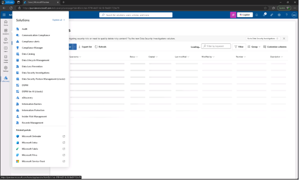

 
2.	케이스 페이지에서 [케이스 만들기(Create case)] 드롭다운을 선택한 후 [검색 만들기(Create Search)]를 클릭 합니다. 
  

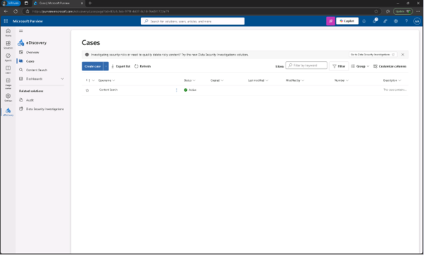

 
3.	Enter 세부사항 대화에서 다음을 입력하세요:

+ 사건 이름: Financial Data Exposure Review
+ 검색명: Financial Data Leak Investigation
+ 사건 설명: Case opened to support security investigation efforts by identifying potential exposure of sensitive financial terms in Microsoft 365 content.
+ 검색 설명: Search targets common high-risk financial keywords to support data security monitoring and policy validation.
 [생성(Create)]를 클릭하여 생성합니다.
  

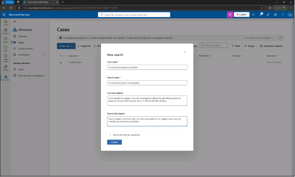

 
4.	금융 데이터 유출 조사 페이지(inancial Data Leak Investigation) 에서 데이터 소스에서 [데이터 소스 추가] – [+(플러스 기호)]를 클릭합니다.
  

 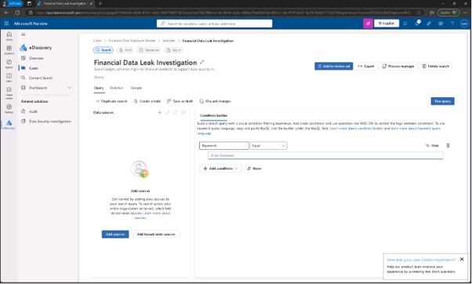

 
5.	소스 검색 화면에서 [재무팀 그룹(Finance team)]을 선택한 후 [저장]을 클릭합니다.
  

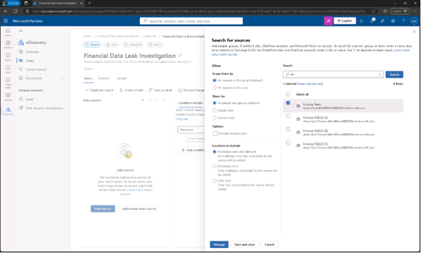

 
6.	조건 빌더 창에서 키워드 [bank accountcredit card] 를 추가한 후 [쿼리 실행(Run query)]를 클릭합니다.
  

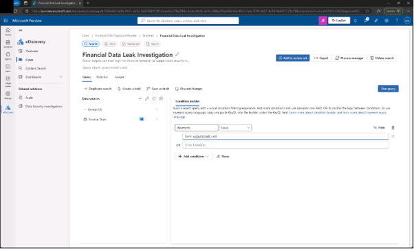
 
7.	통계 항목의 검색 결과선택 플레이아웃에서 [카테고리 포함(Include categories)]과 [쿼리 키워드 보고서 포함(include query keywords report)] 체크박스를 선택한 후 쿼리 [실행(run)]을 클릭합니다.
  

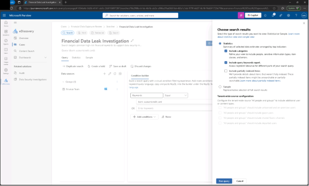
 
8.	검색 결과를 검토하면, 검색 지표 요약을 보려면 통계 탭을 선택하여 샘플 탭을 선택하여 매칭된 콘텐츠를 미리 확인하세요.
  

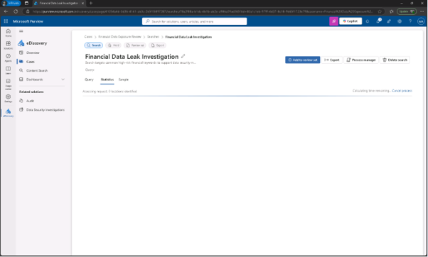
 
 
 
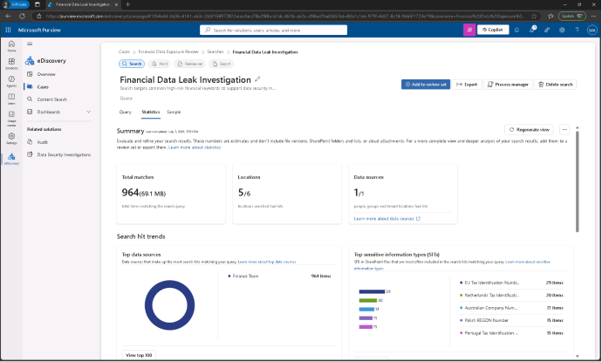

 

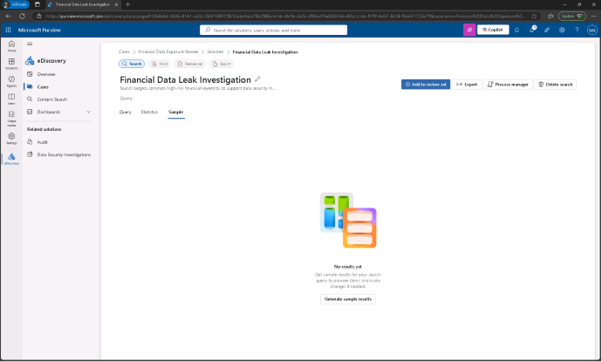

 
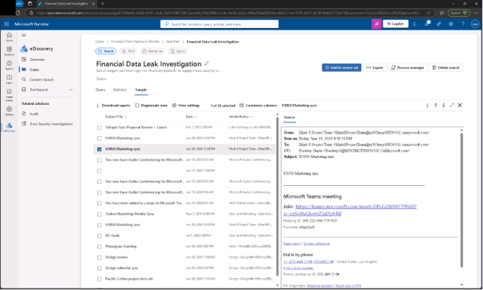
 
 
9.	민감한 금융 데이터가 부적절하게 공유되었는지 확인하기 위해 키워드 기반 콘텐츠 검색을 수행하셨습니다. 이 결과들은 보안 조사를 지원하고 위험 대응을 안내하는 데 도움을 줍니다.
 