# Lab12 – AI 환경에서 데이터를 보호
Microsoft Copilot과 같은 AI 도구가 일상 업무 흐름에 점점 더 통합됨에 따라, 귀사의 팀은 민감한 데이터에 대한 보호 조치를 평가하고 개선하도록 요청받았습니다. 이 실험실에서는 Microsoft Purview DSPM for AI가 정책 집행, 위험 감지, 노출 평가를 통해 AI 도구와의 데이터 상호작용을 어떻게 안전하게 할 수 있는지 탐구하게 됩니다.

## 작업 1: DSPM for AI를 사용하여 생성형 AI 사이트에 대한 DLP 정책을 수립하기

AI 비서를 통한 데이터 손실 위험을 줄이기 위해, 우선 데이터 보안 강화 권고안을 활용해 DLP 정책을 작성해야 합니다. 이 정책은 Edge, Chrome, Firefox의 ChatGPT, Copilot 같은 AI 도구에 민감한 데이터를 붙여넣거나 업로드하는 것을 제한하기 위해 적응 보호(Adaptive Protection)를 사용합니다.

 
1.	Microsoft Edge에서는 https://purview.microsoft.com 로 이동하여 Joni Sherman으로 로그인하세요 

 
2.	Microsoft Purview에서 [솔루션] – [DSPM for AI] – [추천]를 클릭합니다. 
 

 
3.	[데이터 보안 강화 권고(Fortify your data security)]를 클릭합니다.
  

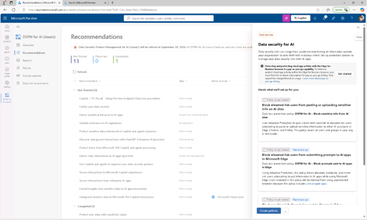

 
4.	AI 플라이아웃 데이터 보안 페이지에서 요약을 검토한 후 [정책 생성Create Policies]를 클릭합니다. 이로 인해 생성형 AI 사이트를 대상으로 사전 설정된 DLP 정책이 생성됩니다.
  

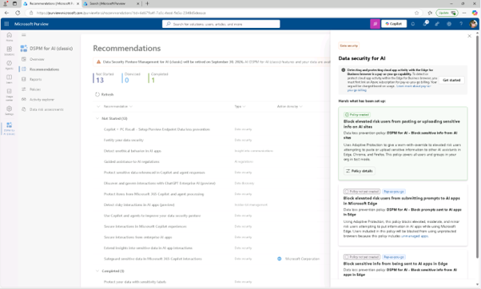

 
5.	정책이 생성되면 정책 보기를 선택하세요.
 

 
6.	정책 세부 사항 섹션에서 솔루션 내 [정책 편집]을 클릭하여 Microsoft Purview에서 데이터 손실 방지 솔루션이 열리면서 정책 편집으로 진행됩니다. 
  

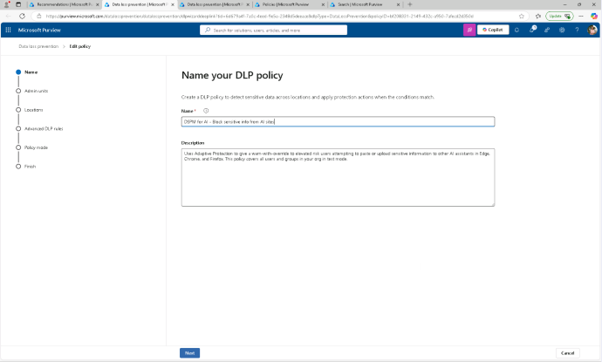

 
7.	Assign admin units 페이지에서 [다음]을 클릭합니다.
  

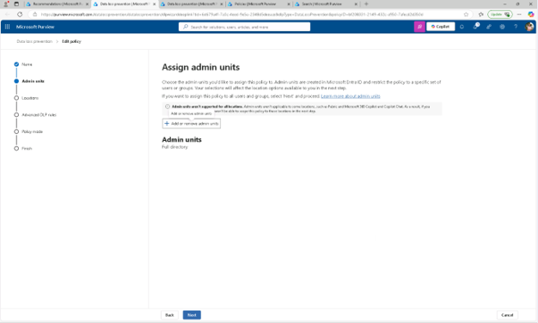
 
8.	‘정책 적용 위치 선택' 페이지에서 정책이 [디바이스(Device)]에 적용되어 있는지 확인 후 [다음(Next)]을 클릭합니다.
 

 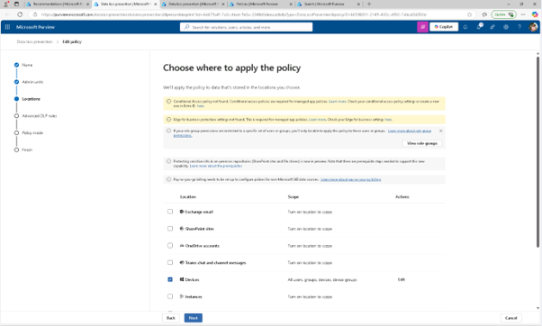

 
9.	고급 DLP 규칙 사용자 맞춤 페이지에서 차단 옆의 [연필 아이콘]을 클릭하여 [위험이 높은 사용자가 규칙]을 볼 수 있도록 오버라이드를 적용하세요.
  

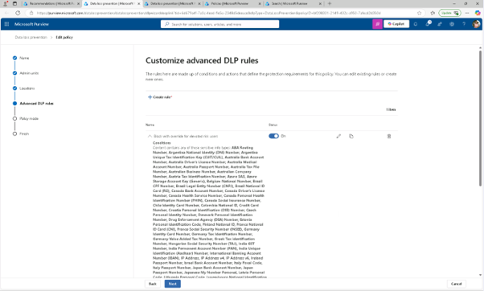

 
10.	DSPM이 AI용으로 만든 규칙 구성을 검토합니다 .

+ 조건 항목에는 포함된 민감한 정보 유형과 규칙이 높은 위험을 기반으로 한 적응 보호(Adaptive Protection)를 사용한다는 점을 확인합니다.
 
  

 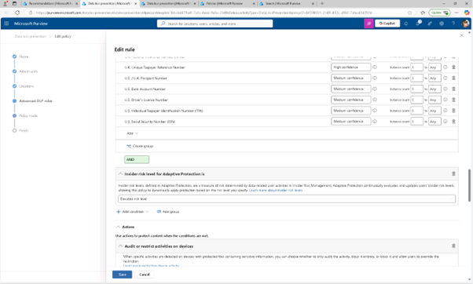

  
 
 + 작업 항목에서 업로드와 붙여넣기 활동 모두에 대해 [민감한 서비스 도메인 그룹 제한 (Sensitive service domain group restriction(s))옆에 있는 [편집(Edit)]를 클릭합니다.
  

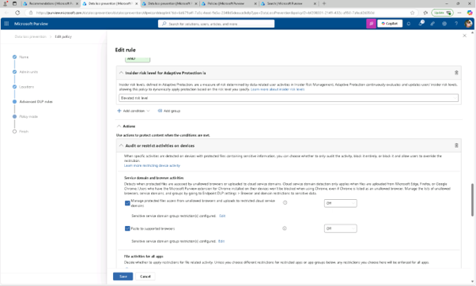
  
 
 + 서비스 도메인 그룹 설정에서 생성형 [AI 웹사이트(Generative AI Websites)가 [차단 및 오버라이드(Block with override)]로 설정되어 있는지 확인합니다.
  

 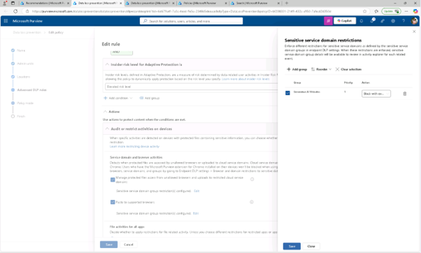
 

 
11.	변경 없이 규칙 편집기를 종료하려면 [취소]를 클릭합니다. 
 

 
12.	고급 DLP 규칙 사용자 지정 페이지에서 [다음(Next)]을 클릭합니다. 
 

 
13.	정책 모드 페이지에서 [시뮬레이션 후 15일 이내에 수정되지 않은 정책을 켜기]를 선택한 후 [다음]을 클릭합니다. 

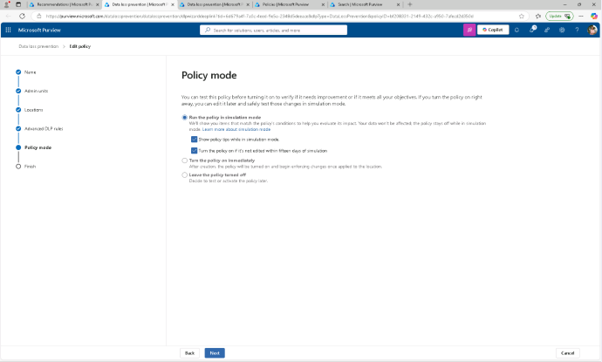

 

 
14.	검토 및 완료 페이지에서 [제출]을 클릭합니다. 
  

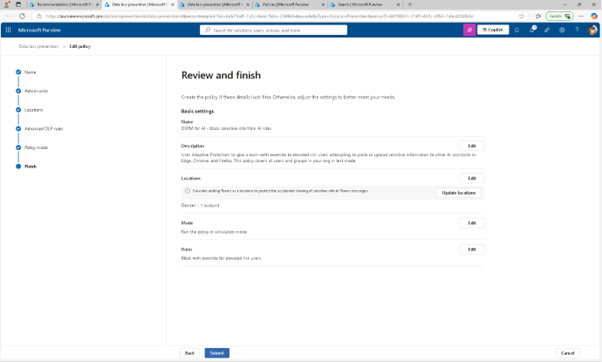

  
15.	정책 업데이트 완료 메시지가 나타나면 [완료]를 클릭합니다. 생성형 AI 사이트에서 민감한 데이터를 공유하는 고위험 사용자를 차단하는 정책을 만들었고, DSPM이 AI를 위해 설정한 정책 구성을 확인했습니다.
 
 
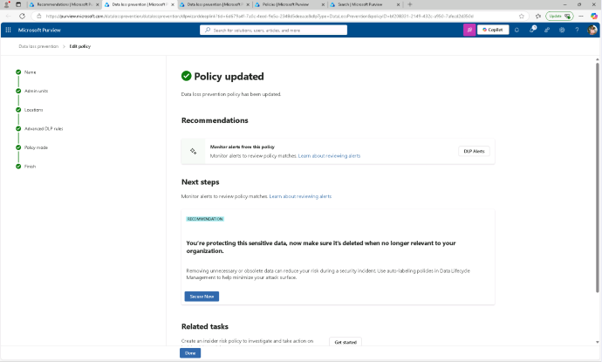
