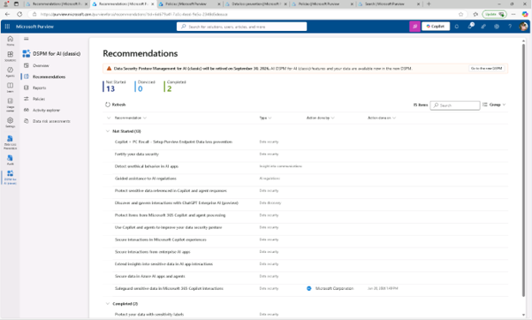
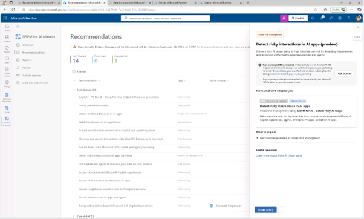
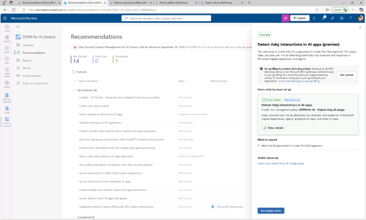
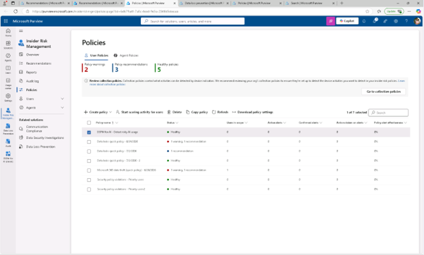
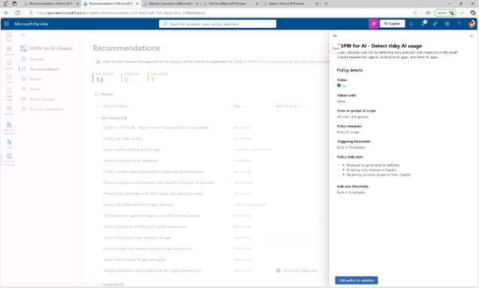
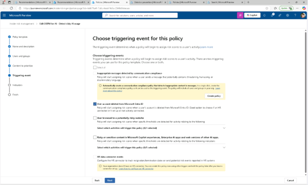
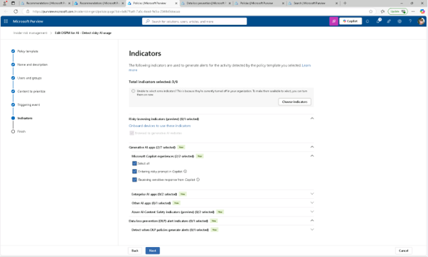
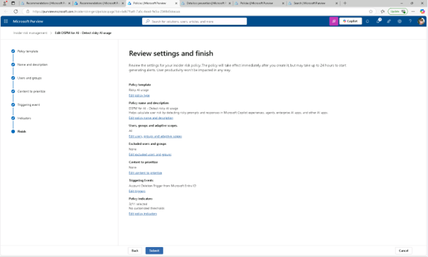

# 작업 2: 위험한 AI 상호작용을 감지하기 위한 내부자 위험 정책 수립
다음으로, Copilot에서 위험한 알림 동작을 감지하는 정책을 만듭니다.

 
1.	Microsoft Purview에서 [솔루션] – [DSPM for AI] – [추천]를 클릭합니다.
  

 
2.	[AI 앱에서 위험한 상호작용 감지(미리보기)( Detect risky interactions in AI apps (preview))] 추천을 클릭합니다. 
  

 
3.	AI 앱에서 위험한 상호작용 감지(미리보기) 플라이아웃 페이지에서 요약을 검토한 후 [정책 생성]을 클릭합니다.
  

 
4.	정책이 생성되면 정책 세부 사항 섹션에서 솔루션 내 [정책 편집]을 클릭하여 Microsoft Purview의 내부자 위험 관리 영역을 엽니다.
 

 
5.	정책 페이지에서 [위험한 AI 사용 감지 정책 – DSPM for AI(DSPM for AI - Detect risky AI usage)항목을 찾아 클릭합니다.
  

 
6.	플라이아웃에서 [정책 편집]을 선택하여 전체 정책 구성을 검토합니다.
  

  
7.	정책 템플릿 선택 페이지에서 해당 정책이 위험한 AI 사용 템플릿을 사용하고 있음을 확하고, 이 정책 페이지에서 트리거 이벤트를 선택할 때까지 [다음(Next)]을 클릭합니다. 
 

 
8.	트리거 이벤트가 [Microsoft Entra ID에서 사용자 계정 삭제(User account deleted from Microsoft Entra ID)]인지 확인하고 위험한 AI 활동 전후에 발생할 수 있는 오프보딩 관련 위험 신호임을 확인 후 [다음(Next)]을 클릭합니다. 
  

 
9.	지표 페이지에서 지표 카테고리를 펼쳐 선택된 신호를 확인합니다. 

+ 생성형 AI 웹사이트(Browsed to generative AI websites)
+ 코파일럿으로부터 민감한 답변(Received sensitive response from Copilot)
+ Copilot에 위험한 프롬프트를 입력(Entered risky prompt in Copilot)
  

 
10.	리뷰 설정 및 완료 페이지에 도달할 때까지 [다음]을 클릭하고, 변경 없이 에디터를 종료하려면 [취소]를 선택하세요. 위험한 AI 상호작용(프롬프트와 응답 포함)을 감지하여 위험한 사용자 행동의 초기 징후를 식별하는 정책을 만들었습니다.
  

 
