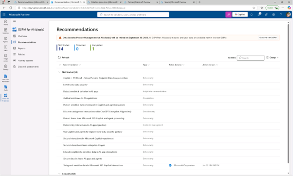
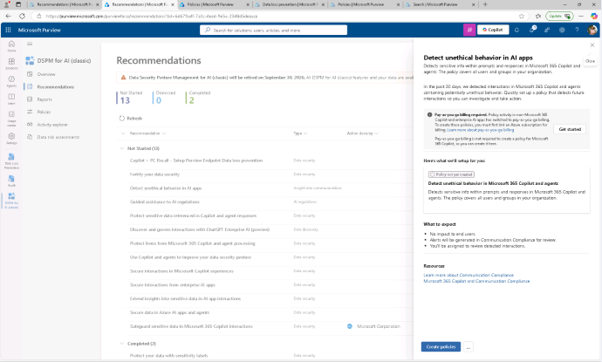
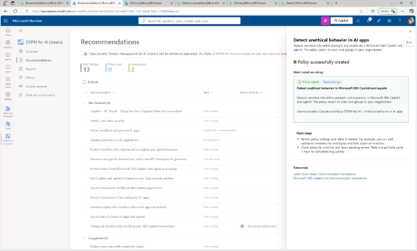
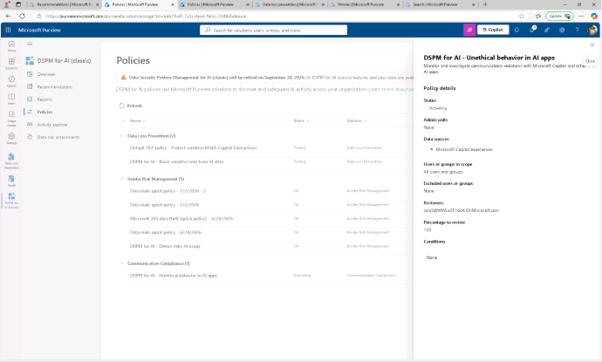
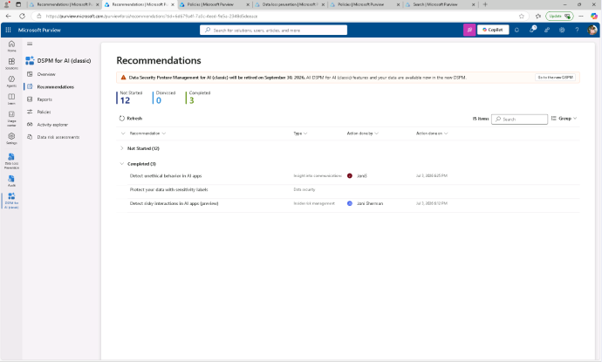

# 작업 3: AI 앱에서 비윤리적 행동을 감지하기
이 작업에서는 Microsoft 365 Copilot 및 기타 AI 애플리케이션에서 비윤리적이거나 부적절한 행동을 감지할 수 있도록 DSPM에서 정책을 만듭니다.

 
1.	Microsoft Purview에서 [솔루션] – [DSPM for AI] – [추천]를 클릭합니다. 
 

 
2.	[AI 앱에서 비윤리적 행동 감지(Detect unethical behavior in AI apps)] 추천을 클릭합니다.
 
 
 
 
3.	플라이아웃에서 이 정책이 구성할 내용을 개요로 검토해 보세요:

+ 기본 정책 명칭은 DSPM for AI – AI 앱에서의 비윤리적 행동입니다.
+ 이 정책은 Microsoft 365 Copilot 및 기타 AI 에이전트의 프롬프트와 응답 내 민감하거나 부적절한 정보를 감지합니다.
+ 조직 내 모든 사용자와 그룹에 적용됩니다.
  

 
4.	커뮤니케이션 준수 정책을 생성하려면 [정책 생성]을 클릭합니다.
  

 
5.	정책 성공적으로 생성된 페이지에서 X를 선택해 플라이아웃을 닫습니다.
  

 
6.	추천 페이지가 새로고침 되고, [AI 앱에서 비윤리적 행동 감지(Detect unethical behavior in AI apps)] 추천은 완료 상태로 이동된 것을 확인합니다.
  

 
7.	왼쪽 내비게이션에서 [정책]을 클릭합니다.
 

 
8.	새로 생성된 [DSPM for AI – AI 앱에서의 비윤리적 행위(Detect unethical behavior in AI apps)] 정책을 선택하여 구성과 상태를 검토하세요.
 

 
9.	DSPM for AI - AI 앱에서의 비윤리적 행동(Detect unethical behavior in AI apps) 페이지에서 X를 선택해 플라이아웃을 닫습니다.  Copilot을 책임감 있게 사용할 수 있도록 AI 애플리케이션 내 비윤리적 활동을 감지하는 정책을 만들었습니다. 

