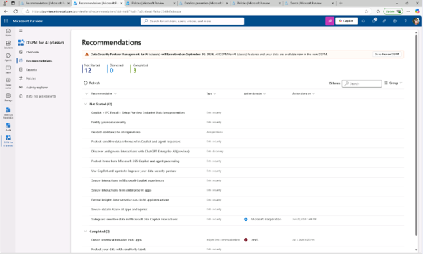
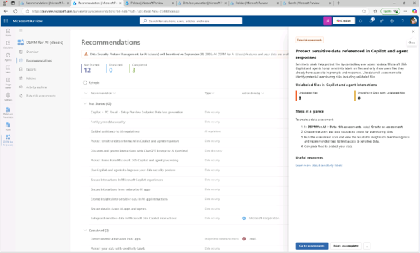
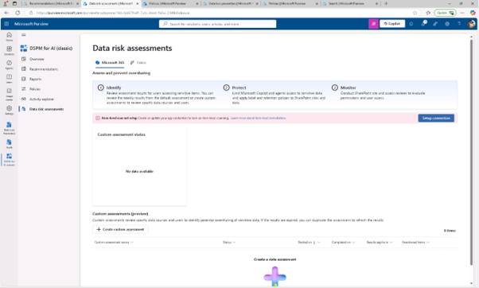
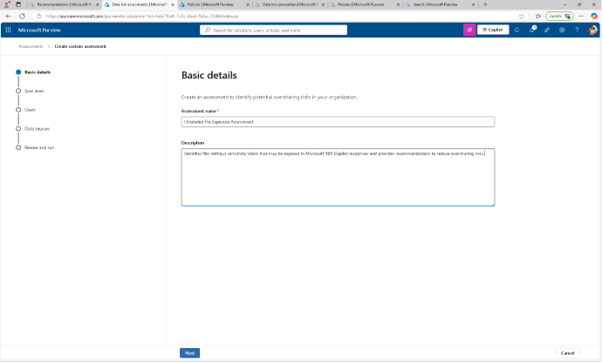
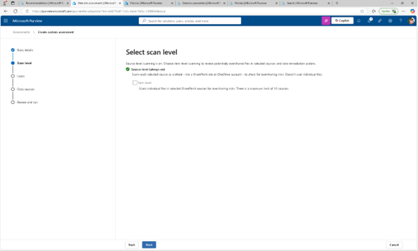
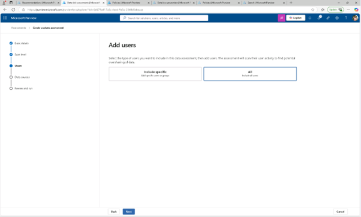
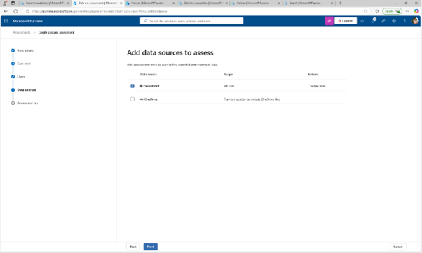
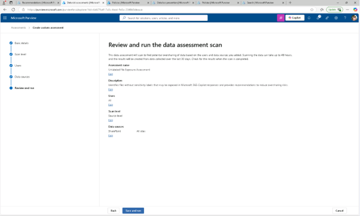
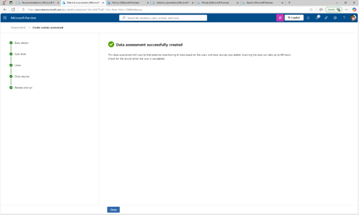
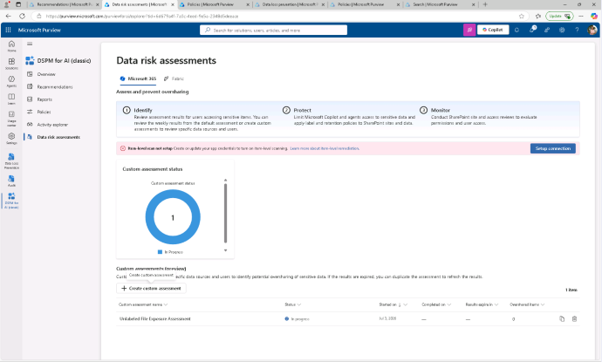

# 작업 4: 라벨이 없는 콘텐츠를 감지하기 위한 데이터 평가 실행
라벨링 보장의 잠재적 공백을 이해하기 위해, Copilot이 접근할 수 있는 민감도 라벨이 없는 파일을 식별하기 위한 데이터 위험 평가를 실행해야 합니다.

 
1.	Microsoft Purview에서 [솔루션] – [DSPM for AI] – [추천]를 클릭합니다.
 

 
2.	DSPM for AI에서 [Copilot 및 에이전트 응답에서 참조된 민감한 데이터 보호(Protect sensitive data referenced in Copilot and agent responses)]를 클릭합니다. 
  

 
3.	Copilot과 상담원 응답 창에서 참조된 Protect 민감한 데이터에서 요약을 검토한 후 [평가로 이동(Go to assessments)]을 클릭합니다.
  

 
4.	데이터 위험 평가 페이지에서 [Create custom assessment]를 선택하세요
  

 
5.	기본 세부 정보 페이지에서 다음을 입력합니다.

+ 이름: Unlabeled File Exposure Assessment
+ 설명: Identifies files without sensitivity labels that may be exposed in Microsoft 365 Copilot responses and provides recommendations to reduce oversharing risks.
 [다음(Next)]을 클릭합니다. 
  

 

 

 
 
6.	사용자 추가(Add users) 페이지에서 모두(All)를 선택한 [다음]을 클릭합니다. 
 
 
 

 
7.	'평가할 데이터 소스 추가' 페이지에서 [SharePoint]를 선택한 후 [다음]을 클릭합니다. 
 

 
 
8.	데이터 평가 스캔 페이지에서 [저장 및 실행]을 클릭합니다. 
 
 

 
9.	데이터 평가 성공적으로 생성됨 페이지에서 [완료]를 클릭합니다. 
 
 

 
10.	제 Microsoft Purview DSPM for AI를 사용해 AI 관련 위험을 탐지하고, 정책을 집행하며, 민감한 데이터 노출을 평가하여 조직이 AI를 안전하게 사용할 수 있도록 돕습니다. 
 
 
 

